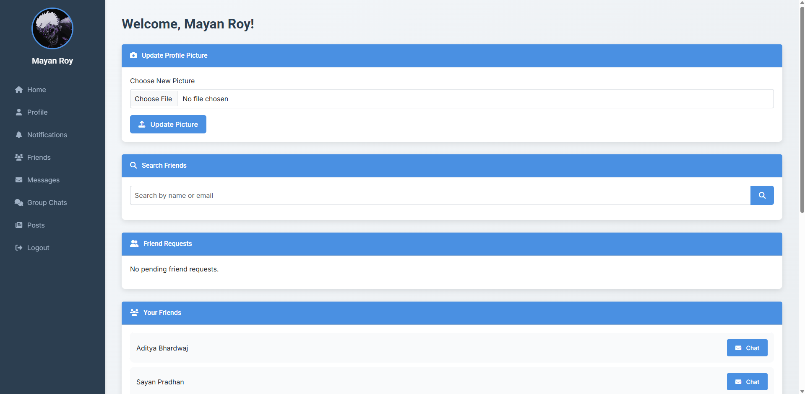
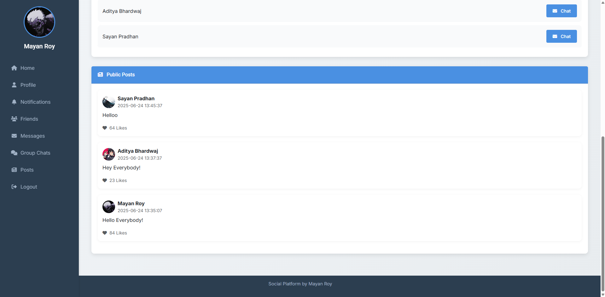
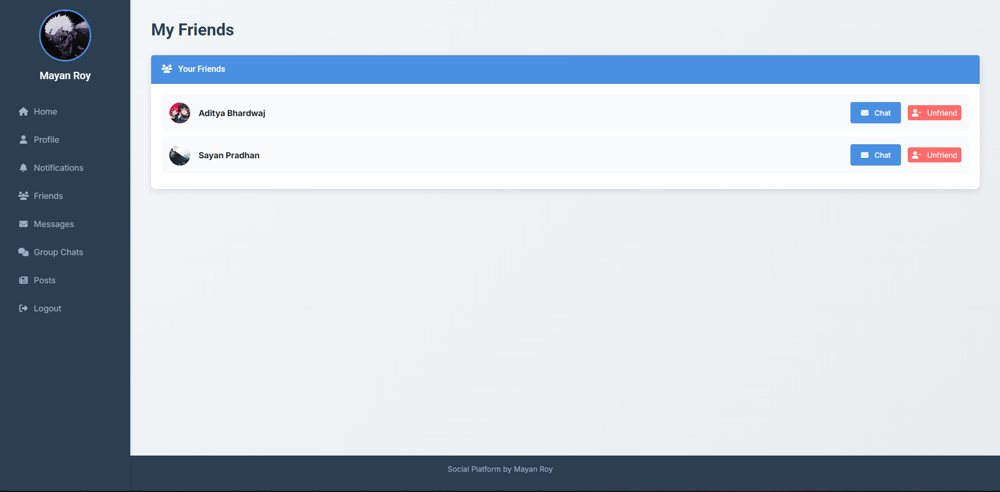
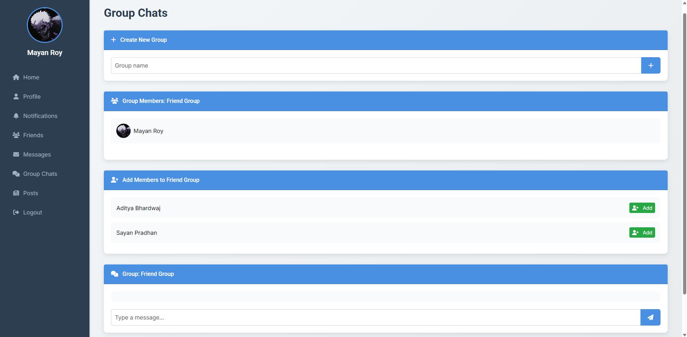

---

# **Social App Like – Web Development Class Task**

## **Overview**

This project is a simple social networking web application created as part of a Web Development class assignment (dated **June 9, 2025**). It includes user authentication (login & registration), a dashboard with a sidebar menu, profile picture upload, and a basic friend request system. The application is built using **PHP**, **MySQL**, and **Bootstrap 5.3.0** for styling.

---

## **Features**

### 🔐 Login Page

* Users can log in using **email or phone number** and password.
* Password must:

  * Be at least **8 characters** long.
  * Include **1 uppercase letter** and **1 number**.
* After **3 failed attempts**, the account is **locked for 30 minutes**.

### 📝 Registration Page

* New users can register with:

  * **Name**
  * **Email**
  * **Phone number**
  * **Password**
* Password strength is validated during registration.

### 🏠 Dashboard Page

* Includes a **sidebar** with the following menu items:

  * **Profile Picture**
  * **Home**
  * **Friends**
  * **Message**
  * **Notification**
  * **Scrap**
  * **Post**
  * **Setting**
  * **Game**
  * **Group Chat**
  * **Logout**
* Upload or update **profile pictures** (old picture is deleted using `unlink()`).
* **Friend Search**: Find users by name or email.
* **Friend Requests**:

  * Status options: **Pending**, **Accepted**, **Blocked**
  * **Blocked users** are excluded from search results.

### 🚪 Logout

* Ends the session and redirects to the login page.

---

## **Project Structure**

```
social_app/
├── uploads/           # Stores user profile pictures
├── config.php         # MySQL database configuration
├── database.sql       # SQL file to create the required tables
├── login.php          # Login script and UI
├── register.php       # Registration script and UI
├── dashboard.php      # Main dashboard with features and sidebar
├── logout.php         # Handles user logout
└── README.md          # Project documentation
```

---

## **Requirements**

* **XAMPP** or any local server with PHP & MySQL support (PHP 7.4+ recommended)
* **MySQL** database
* Modern web browser (Chrome, Firefox, etc.)
* **Bootstrap 5.3.0** (included via CDN)

---

## **Setup Instructions**

### 1. Install XAMPP

* Download from: [https://www.apachefriends.org/](https://www.apachefriends.org/)
* Start **Apache** and **MySQL** services.

### 2. Set Up Project Files

* Place the project folder (`social_app/`) inside `htdocs` (e.g., `C:\xampp\htdocs\social_app\`)
* Create an `uploads/` folder inside the root directory.
* Ensure the `uploads/` folder has write permissions:

  * On Linux: `chmod 777 uploads`

### 3. Configure the Database

* Open [http://localhost/phpmyadmin](http://localhost/phpmyadmin)
* Create a database named `social_app`.
* Import the `database.sql` file to create tables:

  * `users`
  * `friend_requests`
* Update `config.php` with your MySQL credentials (default: username = `root`, password = `""`)

### 4. Launch the App

* Open in your browser: [http://localhost/social\_app/login.php](http://localhost/social_app/login.php)

---

## **Usage**

### 🔸 Registration

* Visit `register.php` and complete the form.
* Ensure the password follows required constraints.

### 🔸 Login

* Go to `login.php` and enter your registered email or phone and password.
* After 3 incorrect attempts, login is locked for 30 minutes.

### 🔸 Dashboard

* Upload a new profile picture (deletes the old one automatically).
* Search for other users by name/email and send friend requests.
* Manage incoming requests (accept/block).
* **Blocked users** will not appear in search results.

### 🔸 Logout

* Click “Logout” from the sidebar to securely end your session.

---

## **Screenshots**











---

## **Troubleshooting**

| Issue                            | Solution                                                               |
| -------------------------------- | ---------------------------------------------------------------------- |
| **Database Connection Error**    | Check `config.php` for correct credentials and ensure MySQL is active. |
| **Profile Picture Upload Fails** | Make sure `uploads/` folder exists and has appropriate permissions.    |
| **Friend Search Not Working**    | Verify that database tables are correctly created and populated.       |

---

## **Future Improvements**

* Implement remaining sidebar features (e.g., Messages, Notifications).
* Make the app fully responsive for mobile devices.
* Enhance security:

  * Add **CSRF protection**
  * Sanitize all user inputs

---

## **Author**
>Mayan Roy

Developed as part of a Web Development class assignment on **June 9, 2025**.


