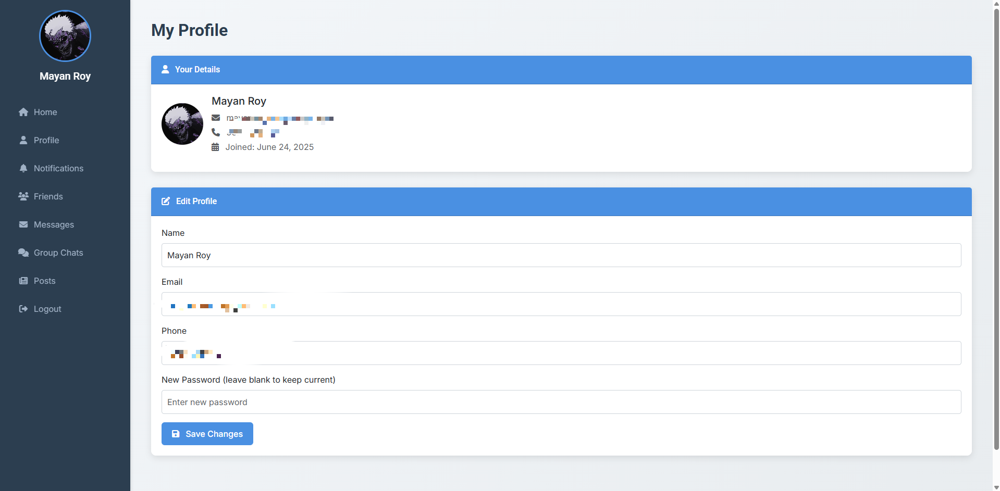

# Social Platform using PHP, Bootstrap

A modern social networking platform built using **PHP**, **MySQL**, **Bootstrap 5.3**, **jQuery**, **Font Awesome**, and custom CSS. This responsive web app allows users to register, log in, manage their profiles, connect with friends, chat one-on-one or in groups, share public posts, and receive notifications—all with a sleek UI featuring smooth animations, gradient backgrounds, and bold typography.

---

## 🔧 Features

### 🔐 User Authentication

* **Login (`login.php`)**:
  Sign in with email or phone and password. Ensures:

  * Minimum 8 characters
  * At least 1 uppercase letter and 1 number
  * Locks account for a few minutes after 3 failed login attempts(can be modified).

* **Registration (`register.php`)**: Sign up with name, email, phone, and password. Validates:

  * Email format
  * 10-digit phone number
  * Password strength
    Prevents duplicate entries and assigns a default profile picture (`default.jpg`).
    UI: Card layout (max-width 400px), Bootstrap styled.

---

### 🏠 Dashboard (`dashboard.php`)

* Sidebar with profile picture, navigation links (Home, Friends, Posts, Messages, Group Chat, Notifications, Profile, Settings, Logout).
* Unread messages badge.
* Displays a feed of recent posts with placeholder like counts.

---

### 👤 Profile Management (`profile.php`)

* Edit name, email, phone, password, and profile picture.
* Shows join date.
* Replaces old profile pictures via `unlink()`.


---

### 🤝 Friend System (`friends.php`, `friend_actions.php`)

* Search users by name or email (excluding blocked users).
* AJAX-based send, accept, or block friend requests.
* Friends list with profile pics, chat buttons, unfriend, and profile view.

---

### 💬 One-to-One Chat (`chat.php`)

* Private messaging with real-time updates (every 3 seconds via AJAX).

---

### 👥 Group Chat (`group_chat.php`, `group_actions.php`)

* Create/join groups, chat in real time.
* Access restricted to group members (`group_members` table).
* Creators auto-added; friends can be invited.

---

### 📢 Public Posts (`posts.php`)

* Create and view public posts.
* Includes user's name, profile picture, and placeholder like count.
* Card-based layout with subtle shadows.
* Included randomized number of likes on post for now.

---

### 🔔 Notifications (`notifications.php`)

* Displays alerts for new messages received and friend requests.
* Mark as read or jump directly to chat.
* Sidebar shows unread count badge over notifications.

---

### 🚪 Logout (`logout.php`)

* Destroy the session and redirects back to login.

---

### 🖥️ Screenshots

#### 1. Dashboard


#### 2. Profile



#### 3. Friends


#### 4. Messages


#### 5. Group Chat


#### 6. Public Posts


---


## ⚙️ Prerequisites

* PHP 7.4+
* MySQL
* Local server (XAMPP, WAMP, LAMP)
* Web browser (Chrome, Firefox, etc.)
* Internet access for:

  * Bootstrap 5.3
  * jQuery 3.6.0
  * Font Awesome 6.5.1
  * Google Fonts (Inter, Roboto)

---

## 🚀 Installation

1. **Clone Repository**

   ```bash
   git clone https://github.com/MR-1124/Social-Platform-using-PHP-Bootstrap
   cd Social Platform
   ```

2. **Set Up Local Server**

   * Install XAMPP or any other alternative.
   * Start Apache and MySQL.
   * Move the project to `C:/xampp/htdocs/` or wherever you have installed XAMPP.

3. **Database Configuration**

   * Go to `http://localhost/phpmyadmin`
   * Create new DB: `social_app`
   * Import `db.sql` in project folder
   * Tables created: `users`, `friend_requests`, `messages`, `group_chats`, `group_members`, `group_messages`, `posts`, `notifications`
   * Update DB credentials in `config.php`

4. **Uploads Directory**

   * Create `uploads/`
   * Add a default image - `default.jpg`
   * Ensure write permissions:

     ```bash
     chmod 777 uploads/
     ```

5. **Run the App**

   * Open: `http://localhost/Social-Platform-using-PHP-Bootstrap/login.php`

---

## 🧪 Usage

* **Sign Up:**
  Go to `register.php` and fill in the form. Redirects to login on success.

* **Log In:**
  Login via `login.php`. After 3 failed attempts, account is locked for 30 mins.

* **Explore Features:**

  * **Dashboard:** Posts feed, sidebar navigation
  * **Profile:** Edit profile picture/details
  * **Friends:** Add, manage, and chat with friends
  * **Chats:** Real-time private and group messaging
  * **Posts:** Create and browse user posts
  * **Notifications:** View and clear alerts
  * **Logout:** End session

---

## 🧩 Contributing

1. Fork the repo
2. Create a branch: `git checkout -b feature/your-feature`
3. Commit: `git commit -m "Add feature"`
4. Push: `git push origin feature/your-feature`
5. Open a Pull Request

Please follow project conventions (Bootstrap classes, PHP standards) and test your additions.

---


## ⚠️ Notes

* Built for **local use** as a project (no advanced input/file validation).
* **Security** is not a priority here.
* Like counts are **static placeholders** and are currently randomized numbers.
* Sidebar toggle for mobile is recommended as an enhancement(will be updated).

---

## 👤 Author

**Mayan Roy**\
[LinkedIn](https://www.linkedin.com/in/mayan-roy/)
[GitHub](https://github.com/MR-1124/)

---

## 📄 License

This project is licensed under the **MIT License**. See `LICENSE` for details.


